<!--
  ──────────────────────────────────────────────────────────────
  Utkarsh Kushwaha · github.com/utkarshwrks — visual edition
  Requires in this repo (utkarshwrks/utkarshwrks):
    · assets/hero.svg
    · assets/divider.svg
    · assets/telemetry.svg
  Search "TODO" before publishing — 2 repo names need confirming.
  ──────────────────────────────────────────────────────────────
-->

 

&nbsp;
&nbsp;
&nbsp;

  

<table>
  <tr>
    <td align="center" width="220"><b>4×</b> hackathon podiums, incl. a national 1st 🥇</td>
    <td align="center" width="220"><b>550+</b> DSA problems solved across LC · CF · CN</td>
    <td align="center" width="220"><b>8+</b> projects built & shipped — all live in the cards below</td>
    <td align="center" width="220"><b>99.9%</b> uptime on backend services I've shipped</td>
  </tr>
</table>

## Builds

<table>
  <tr>
    <td width="50%">
      <a href="https://github.com/utkarshwrks/openpulse"><!-- TODO: confirm repo name -->
        
      </a>
    </td>
    <td width="50%">
      <a href="https://github.com/utkarshwrks/civicchain"><!-- TODO: confirm repo name -->
        
      </a>
    </td>
  </tr>
  <tr>
    <td width="50%">
      
    </td>
    <td width="50%">
      
    </td>
  </tr>
  <tr>
    <td width="50%">
      
    </td>
    <td width="50%">
      
    </td>
  </tr>
  <tr>
    <td width="50%">
      
    </td>
    <td width="50%">
      
    </td>
  </tr>
</table>

🥇 <b>Prahari</b> — built for the SafeClick 2.0 national hackathon (MP Police) · won <b>1st place</b>

## Wins

 

 

&nbsp;

## Stack

<table>
  <tr>
    <td align="right"><b>Languages</b></td>
    <td></td>
  </tr>
  <tr>
    <td align="right"><b>Backend & APIs</b></td>
    <td></td>
  </tr>
  <tr>
    <td align="right"><b>Frontend</b></td>
    <td></td>
  </tr>
  <tr>
    <td align="right"><b>AI & ML</b></td>
    <td></td>
  </tr>
  <tr>
    <td align="right"><b>Data & Cloud</b></td>
    <td></td>
  </tr>
  <tr>
    <td align="right"><b>Tooling</b></td>
    <td></td>
  </tr>
</table>

**GenAI in production** &nbsp;·&nbsp; `Gemini (Vision + Text)` `Claude` `LLM Integration` `RAG & Vector Embeddings` `Prompt Engineering` `Azure Speech (STT/TTS)`

**Foundations** &nbsp;·&nbsp; `DSA` `OOP` `DBMS` `REST` `JWT Auth` `SQL` `Twilio`

## Analytics

  

<!--
  OPTIONAL — stats / languages / streak cards.
  The public servers for these (github-readme-stats.vercel.app, streak-stats.demolab.com)
  keep going down in 2026, which breaks the images. To use them reliably, deploy your own
  free copy on YOUR Vercel account:
    1. Open  https://vercel.com/new/clone?repository-url=https://github.com/anuraghazra/github-readme-stats
    2. Deploy, then in Vercel → Project → Settings → Environment Variables add:
       PAT_1 = a GitHub personal access token (no special scopes needed)
    3. Replace YOUR-DOMAIN below with your new deployment's domain and uncomment.

  

-->

  

<b>utkarshwrks</b> · designed & built by hand — markdown, hand-coded SVGs, zero templates

